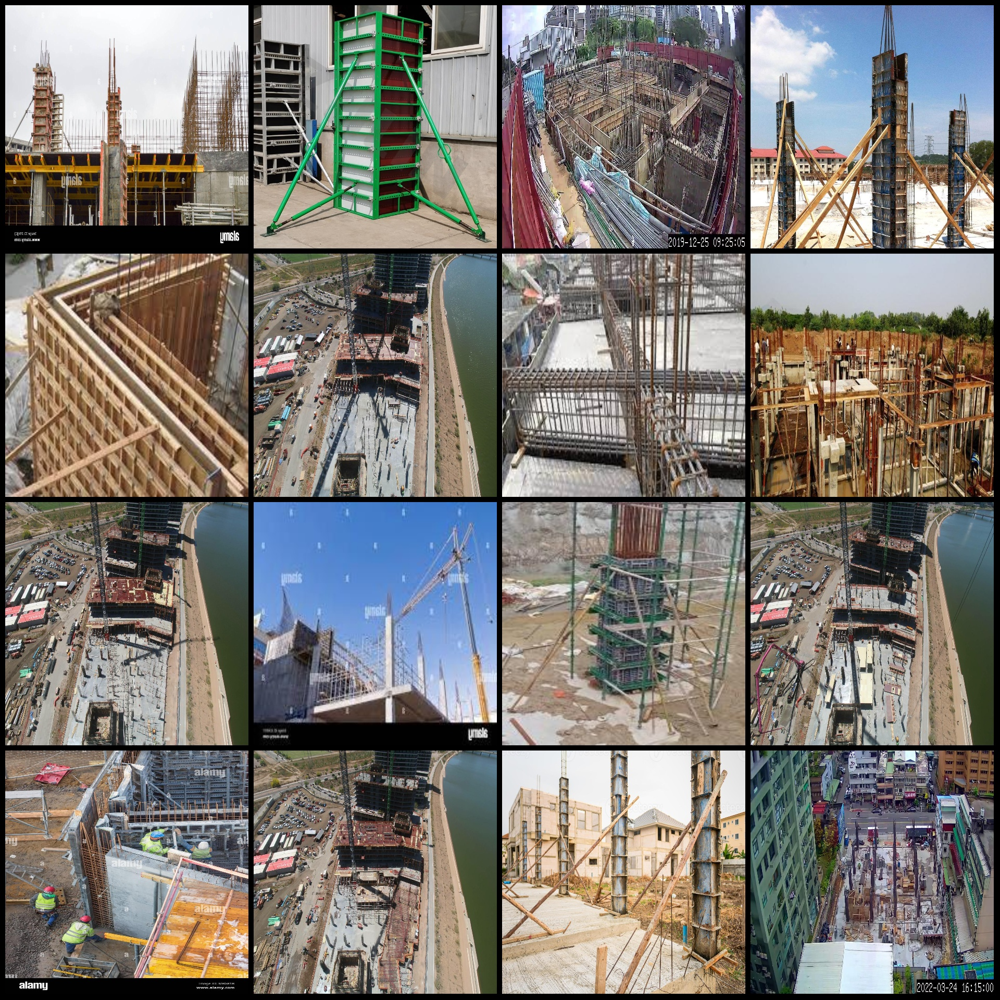
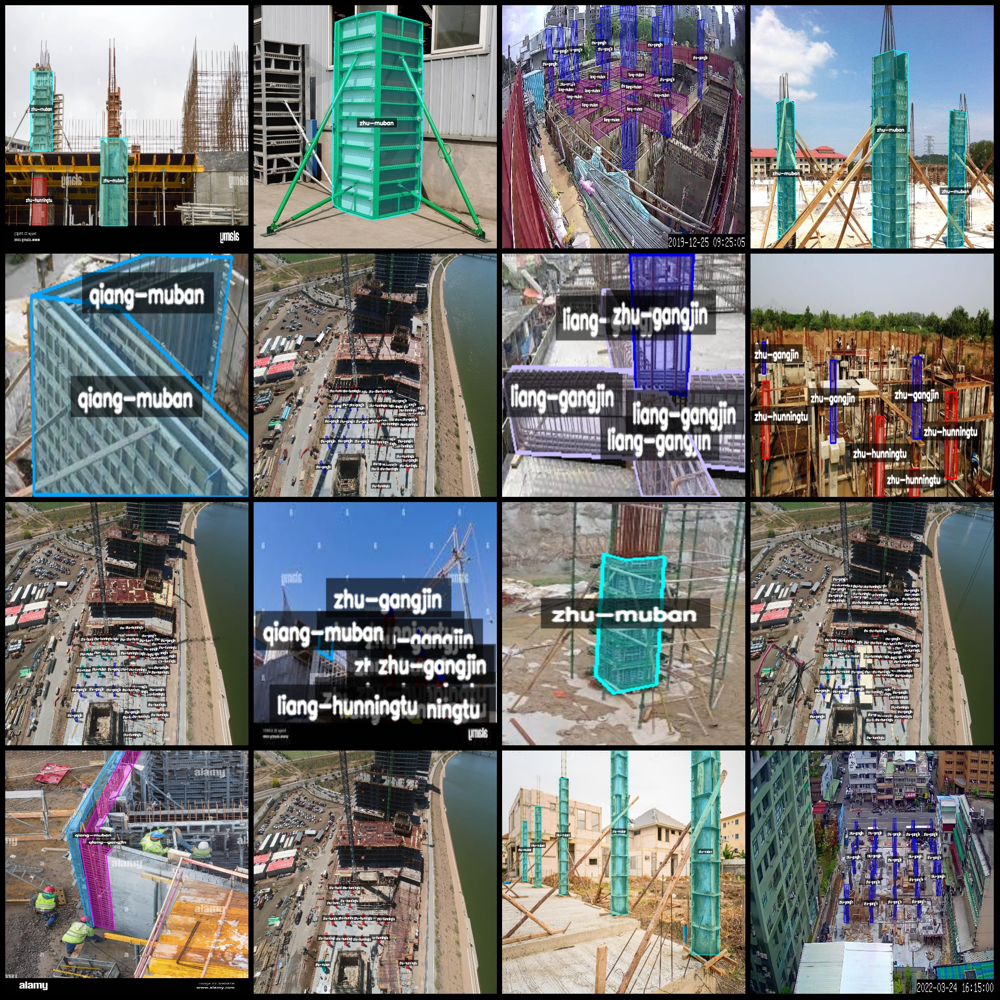
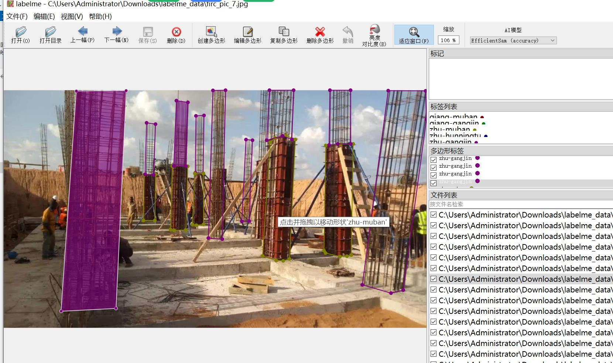

# Smart Construction Building Structural Rebar Concrete Template Identification and Segmentation Data Set (labelme format) - 387 Images, 9 Categories

Dataset Format: labelme format (without mask files, only including jpg images and corresponding json files).
Number of Images in JPG files: 387.
Number of Annotations in JSON files: 387.
Number of Category Types: 9.
Label categories: ["liang-gangjin", "liang-hunningtu", "liang-muban", "qiang-gangjin", "qiang-hunningtu", "qiang-muban", "zhu-gangjin", "zhu-hunningtu", "zhu-muban"].
["Beam-reinforcement", "Beam-concrete", "Beam-formwork", "Wall-reinforcement", "Wall-concrete", "Wall-formwork", "Column-reinforcement", "Column-concrete", "Column-formwork"]
Number of boxes for each category:  
"liang-gangjin": 389  
"liang-hunningtu": 337  
"liang-muban": 444  
"qiang-gangjin": 86  
"qiang-hunningtu": 111  
"qiang-muban": 127  
"zhu-gangjin": 2698  
"zhu-hunningtu": 2667  
"zhu-muban": 652  
Total box count: 7511.
Annotation tool used: labelme = 5.5.0.
Image resolution: Multi-resolution images, such as 1920x1280, 930x837, etc.
Annotation rule: Polygon polygon for categories.
Important Note: The dataset can be opened and edited using labelme, but the json dataset needs to be converted into mask or yolo format or coco format for instance segmentation or instance 
segmentation.
Special Disclaimer: This dataset does not guarantee any accuracy in the model trained or weight files.
Image preview:
Annotation example:
Original image (randomly selected 16 images):
Annotation drawing results:
## Images

Here is a pay link on Stripe ( https://buy.stripe.com/3cs8yP7sY87d0vu9AB ). Please contact me lonlonago@foxmail.com after funding $89, and I will send you a complete data files , thank you!

